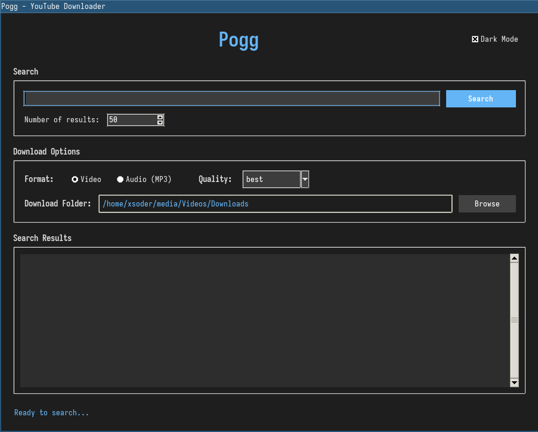
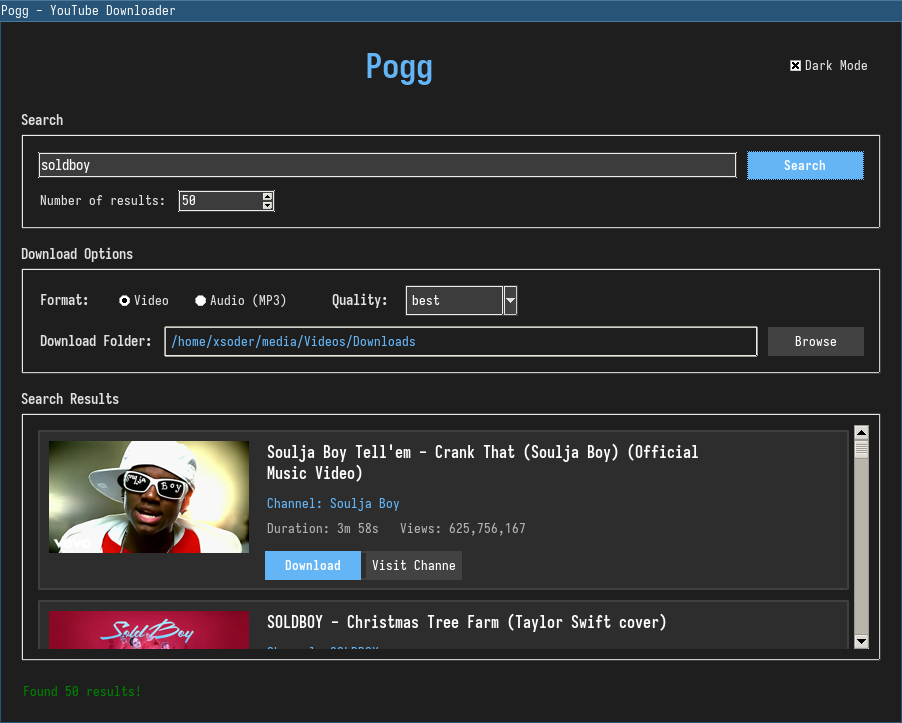
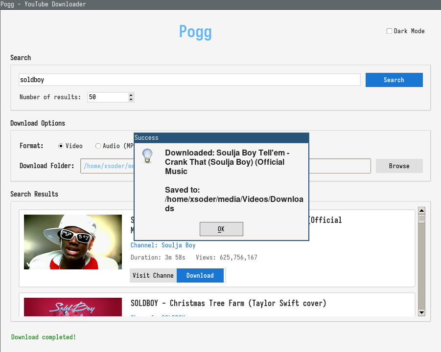

# POGG

>![WARNING]
> Linux and Macos only for the start script.

The ultimate simple GUI video and audio downloader for youtube.





## Instruction

Just run the start script. Dependency is done through the requirements.txt.

``` bash
    $ ./start
```
